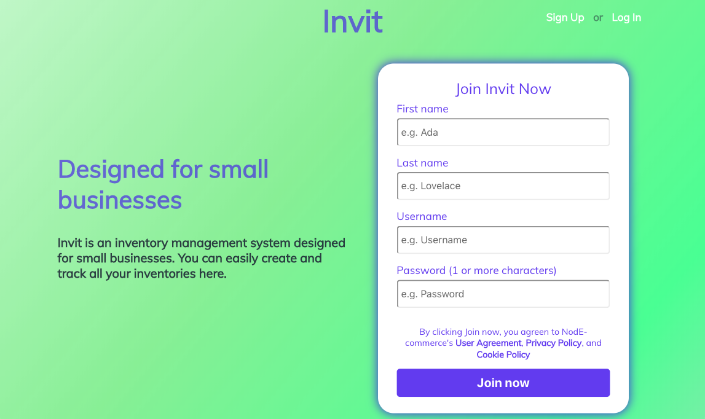
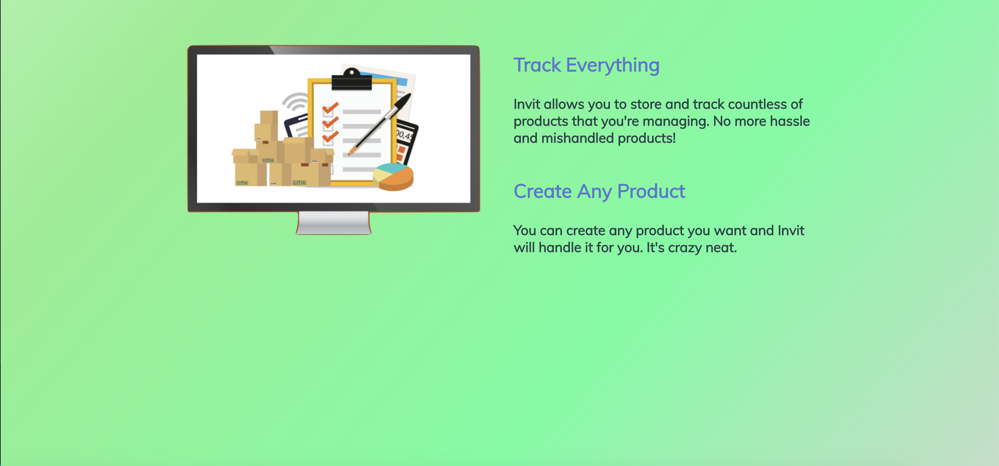
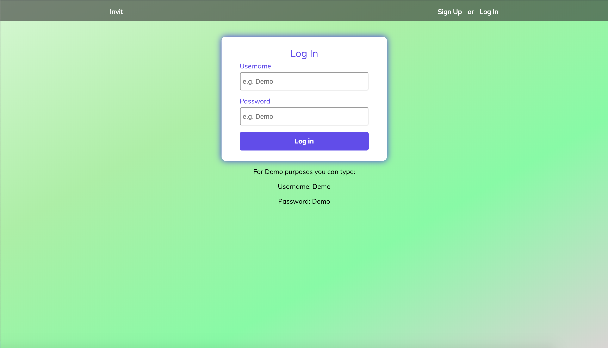
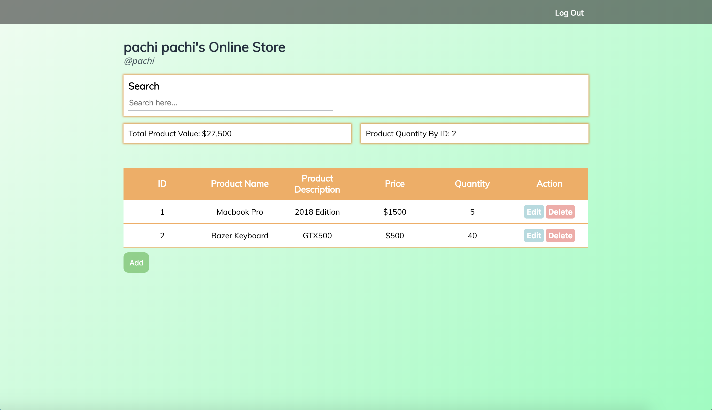

# Invit
Invit is a minimalist Inventory Management Systems designed for personal and small business's needs. It allows you to easily create and track all your products with simplicity and no hassle. 
## Demo
https://pure-earth-57522.herokuapp.com/

## Limitations
There are a few functionality from the app that I had to cut from the project scope due to the lack of time available. It will be implemented further overtime.
1) Need flash feedback when authenticating registration and login
2) Logged in user needs to be given a session
3) API access to their account needs to be protected 
4) User needs to be able to logout
5) Items and products needs to be assigned to the appropriate user who created them. 
 
## Screenshots

 
## Technology
HTML/CSS/JavaScript/jQuery/NodeJS/Express/MongoDB/mLAB/Mongoose/PassportJS/JWT/TravisCI/Heroku/Mocha & Chai

## Authors
Martin Tirtawisata
 
