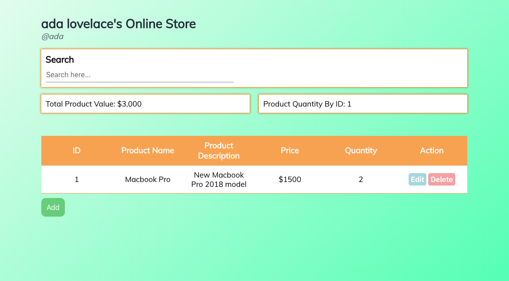
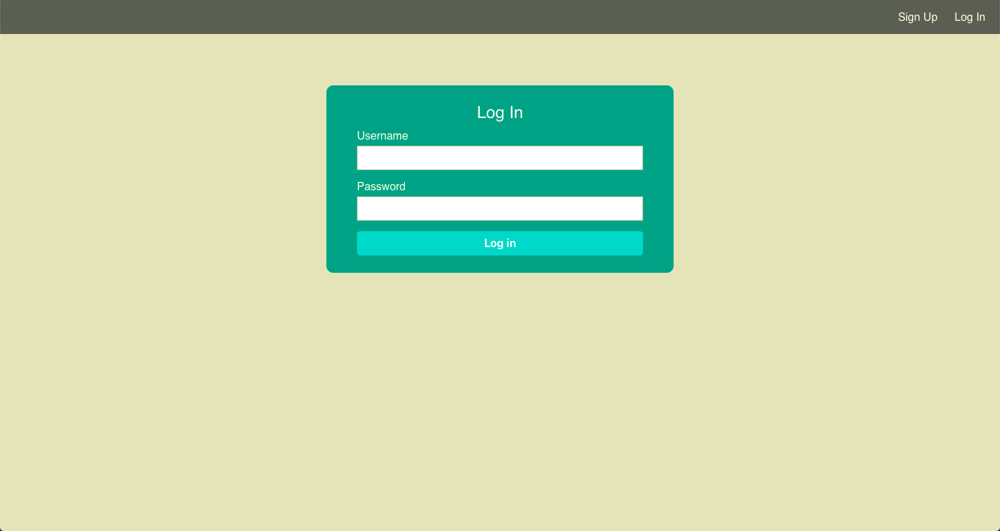

# NodE-Commerce
NodE-Commerce is an e-commerce app that allows the user to sell items online. The user will be able to add, edit, and delete the items in their listing. The user will be able to register themselves to be authenticated as a seller

## Demo
https://pure-earth-57522.herokuapp.com/

## Limitations
There are a few functionality from the app that I had to cut from the project scope due to the lack of time available. It will be implemented further overtime.
1) When adding a new product, the browser has to be reloaded due to the inconsistency of the http request
2) When updating a product, the browser has to be reloaded due to the inconsistency of the http request
3) Logged in user needs to be given a session
4) API access to their account needs to be protected 
5) User needs to be able to logout
6) Items and products needs to be assigned to the appropriate user who created them. 
 
## Screenshots

 
## Technology
HTML/CSS/JavaScript/jQuery/NodeJS/Express/MongoDB/mLAB/Mongoose/PassportJS/JWT/TravisCI/Heroku/Mocha & Chai

## Authors
Martin Tirtawisata
 
